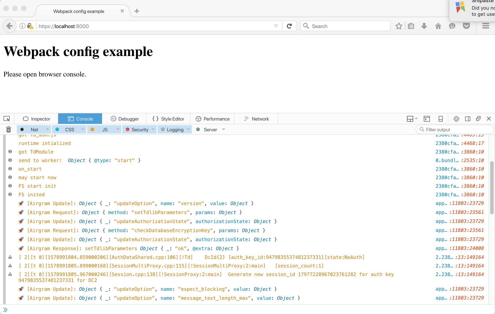

# Webpack Config Example

This is a simple example how to run `@airgram/web` in browser with Webpack, using `asm.js` that can be run on KaiOS.

Tested on Firefox 48.0.2, which is using the same Gecko v48 as KaiOS 2.5.



## Usage

1. `yarn install --ignore-engines`

1. Modify `node_modules/tdweb/dist/2380cfa0e562e148fa50.worker.js`

```js
mode = options.mode || 'wasm';

# to

mode = options.mode || 'asmjs';
```

1. Build bundle:
```bash
$ yarn run build
```

or run server:
```bash
$ yarn run server
```
